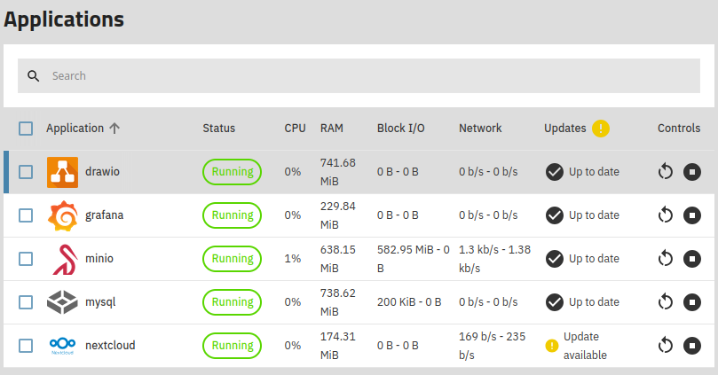
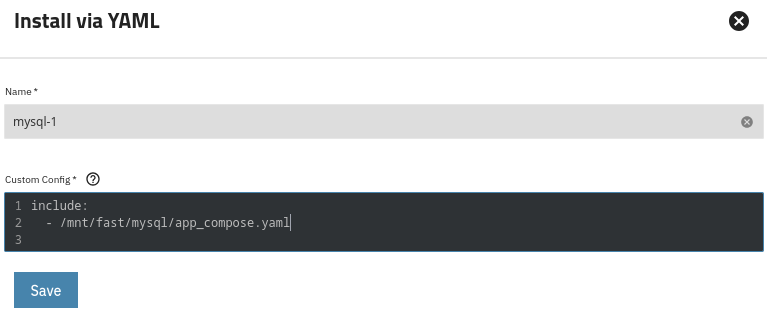
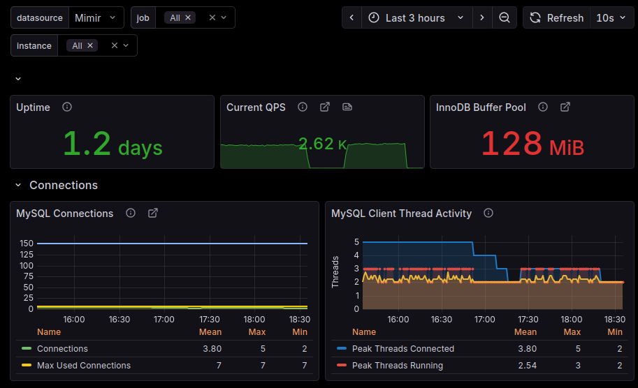

**TL;DR** TrueNAS makes it easy to deploy containerized environments as "Apps". This post describes how to build a custom app that deploys MySQL, phpMyAdmin, mysqld_exporter, and how to monitor the database with Grafana.

# Background
I recently upgraded my custom built storage server from TrueNAS Core to TrueNAS SCALE, now just called [TrueNAS](https://www.truenas.com/truenas-community-edition/) (Community Edition). Firstly, I was impressed with how seemless the upgrade was. Especially considering it's switching from FreeBSD to Debian, and from jails to docker. Secondly, I like the new UI, it's more modern and quite responsive.

One of the reasons I wanted to upgrade, besides Core being EOL, was to see what the containerized experience is like. With Core there were plugins, both official from iXsystems and community created, that used jails and FreeBSD utilities to deploy things like Minio and Nextcloud. With SCALE, the name has changed to "Apps" and under the covers docker and docker compose are used to deploy containerized applications. 

Just like before, there are lots of predefined apps. Users can browse or search under `Apps -> Discover`, which shows mix of `stable` and `community` apps. For now I've installed a few and they worked pretty well out of the box.



It's also possible to deploy custom apps via `Apps -> Discover -> three dots in upper right -> Install via YAML`. That's what I used to install the MySQL environment, described in the next section.

# Crafting a database environment

The goal was to create an app with 3 workloads:

1. [MySQL](https://www.mysql.com/) - the venerable RDMS
2. [phpMyAdmin](https://www.phpmyadmin.net/) - a web-based GUI for admistering the database
3. [mysqld_exporter](https://github.com/prometheus/mysqld_exporter) - a Prometheus exporter for monitoring the database

First I created a new Dataset on my fast vdev `/mnt/fast/mysql` and set `apps` as the 
owner and group. Next via a shell I created a directory `mysql_data` and two files for configuration:

- `app_compose.yaml`: Docker compose file
- `exporter_config.toml`: config file for Prometheus exporter

Let's look at the Docker compose file

```yaml
version: '3.8'

services:
  mysql:
    image: mysql:latest
    restart: always
    environment:
      MYSQL_ROOT_PASSWORD: MY-DB-ROOT-PASSWORD
      MYSQL_DATABASE: MY-DB-NAME
      MYSQL_USER: MY-DB-USER
      MYSQL_PASSWORD: MY-DB-USER-PASSWORD
    volumes:
      - ./mysql_data:/var/lib/mysql
    ports:
      - "3306:3306"

  phpmyadmin:
    image: phpmyadmin/phpmyadmin:latest
    restart: always
    depends_on:
      - mysql
    environment:
      PMA_HOST: mysql
      MYSQL_ROOT_PASSWORD: MY-DB-ROOT-PASSWORD
    ports:
      - "6060:80"

  mysqld-exporter:
    image: prom/mysqld-exporter:latest
    restart: always
    command: ["mysqld_exporter", "--log.level", "debug", "--config.my-cnf", "/.my.cnf", "mysqld.address", "mysql:3306"]
    environment:
      DATA_SOURCE_NAME: "exporter:MY-EXPORTER-PASSWORD@mysql:3306/"
    depends_on:
      - mysql
    volumes:
      - ./exporter_config.toml:/.my.cnf
    ports:
      - "9104:9104"
```

It has 3 sections, one for each workload. Of course this shows example users and passwords, be secure when deploying into a real environment. The exporter config contains the following:

```toml
[client]
user = exporter
password = MY-EXPORTER-PASSWORD
```

The easiest way to install this as an "App" in TrueNAS is to use the `include` directive and point to the location of the `app_compose.yaml` file, as shown below.



Saving the config starts the app.

# Post install configuration

At this point the both MySQL and phpMyAdmin should be up and running. However the Prometheus exporter will not work as there is no `exporter` database user. I logged
into phpMyAdmin (via port `6060` on my TrueNAS server), and created the user, equivalent
to the SQL statement in the mysqld_exporter docs

```sql
CREATE USER 'exporter'@'localhost' IDENTIFIED BY 'MY-EXPORTER-PASSWORD' WITH MAX_USER_CONNECTIONS 3;
GRANT PROCESS, REPLICATION CLIENT, SELECT ON *.* TO 'exporter'@'localhost';
```

After the user was created, I could start to see data at the metrics endpoint `http://<my-truenas-server>:9104/metrics`, which look like this sample

```json
# HELP mysql_global_status_buffer_pool_pages Innodb buffer pool pages by state.
# TYPE mysql_global_status_buffer_pool_pages gauge
mysql_global_status_buffer_pool_pages{state="data"} 7168
mysql_global_status_buffer_pool_pages{state="free"} 1024
mysql_global_status_buffer_pool_pages{state="misc"} 0
# HELP mysql_global_status_bytes_received Generic metric from SHOW GLOBAL STATUS.
# TYPE mysql_global_status_bytes_received untyped
mysql_global_status_bytes_received 1.5961840888e+10
# HELP mysql_global_status_bytes_sent Generic metric from SHOW GLOBAL STATUS.
# TYPE mysql_global_status_bytes_sent untyped
mysql_global_status_bytes_sent 1.208720008e+09
# HELP mysql_global_status_commands_total Total number of executed MySQL commands.
# TYPE mysql_global_status_commands_total counter
mysql_global_status_commands_total{command="admin_commands"} 7231
mysql_global_status_commands_total{command="alter_db"} 0
mysql_global_status_commands_total{command="alter_event"} 0
mysql_global_status_commands_total{command="alter_function"} 0
```

I added the endpoint as a scrape target on my server that runs alloy:

 scrapes the endpoint every 15s and remote writes the data to my homelab [Mimir](https://grafana.com/docs/mimir/latest/) instance")


Next, I created a `grafana` user with `SELECT` only permissions to use for a Grafana datasource. I also installed the [MySQL Exporter Quickstart and Dashboard](https://grafana.com/grafana/dashboards/14057-mysql/) on the Grafana instance running on my TrueNAS.




In the next blog post I'll cover ingesting IMDB's public datasets into the database.


* Cover photo by <a href="https://unsplash.com/@pawel_czerwinski?utm_content=creditCopyText&utm_medium=referral&utm_source=unsplash">Pawel Czerwinski</a> on <a href="https://unsplash.com/photos/a-black-and-white-photo-of-a-cross-in-the-middle-of-a-picture-WEizaiwLk1k?utm_content=creditCopyText&utm_medium=referral&utm_source=unsplash">Unsplash</a>
      