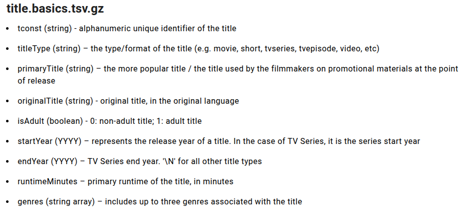
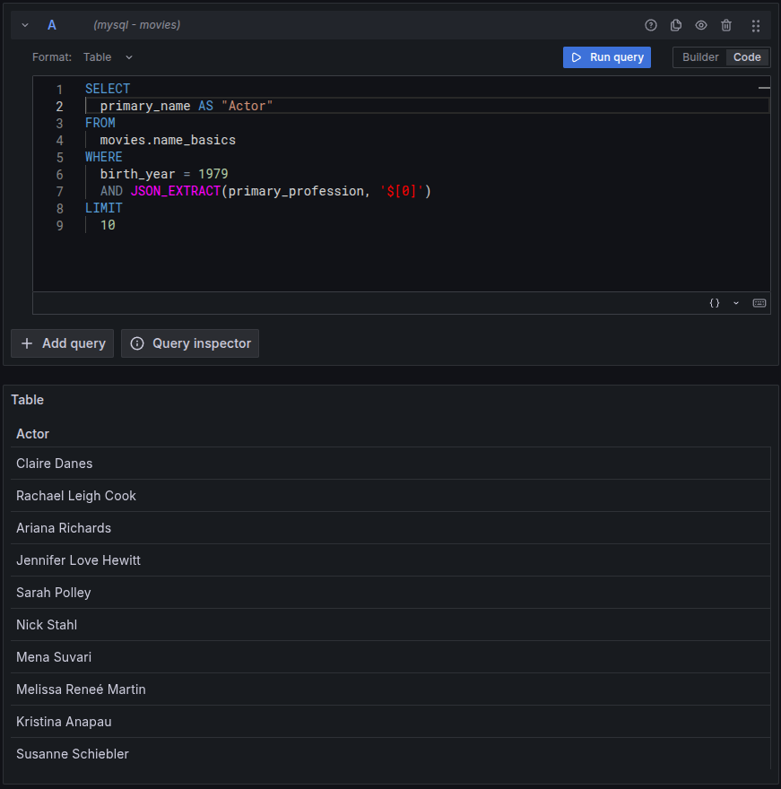
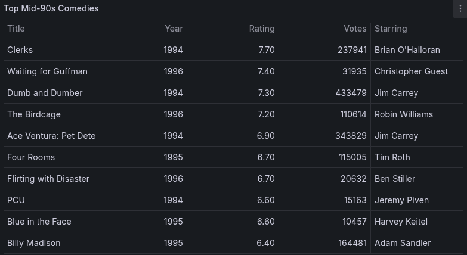

+++
date = '2025-09-29T20:32:07-06:00'
draft = false
title = "Adding IMDb's Public Dataset to MySQL"
tags = ["movies", "sql", "grafana"]
+++


In my [previous post]() I described how to setup a MySQL environment on TrueNAS (or via docker more generally). I wanted to kick the tires on the database by loading it with an interesting dataset. I chose [IMDb's public dataset](https://developer.imdb.com/non-commercial-datasets/). This post details the approach I took to ingesting the data and some basic queries to check that everything works.

# IMDb Non-Commercial Datasets

The datasets come as compressed TSV (tab separated) files, along with a description of each column:



Once downloaded and uncompressed, this was the set of files and sizes to work with:

```shell
> ls -lh *.tsv
-rw-r--r-- 1 vernon vernon 862M Sep  5 15:21 name.basics.tsv
-rw-r--r-- 1 vernon vernon 2.5G Sep  5 15:21 title.akas.tsv
-rw-r--r-- 1 vernon vernon 981M Sep  5 15:22 title.basics.tsv
-rw-r--r-- 1 vernon vernon 375M Sep  5 15:22 title.crew.tsv
-rw-r--r-- 1 vernon vernon 229M Sep  5 15:22 title.episode.tsv
-rw-r--r-- 1 vernon vernon 4.0G Sep  5 15:22 title.principals.tsv
-rw-r--r-- 1 vernon vernon  27M Sep  5 15:22 title.ratings.tsv
```

The description gives the expected data type for each column, but it doesn't say how long strings
ought to be. Since the dataset is static, I first wrote a program to parse the data and find the 
maximum length for each column. The program also checks for empty values and counts the total rows.
This info was useful in the following step of defining the database tables.

```python
import glob

from dataclasses import dataclass, field

@dataclass
class Column:
    name: str
    has_nulls: bool = False
    max_width: int = 0

@dataclass
class Table:
    name: str
    columns: dict = field(default_factory=dict)
    rows: int = 0

def main():
    fnames = glob.glob("*tsv")
    tables = {}
    for fname in fnames:
        table = Table(fname)
        with open(fname, encoding="utf-8") as f:
            keys = f.readline().strip().split("\t")
            for key in keys:
                table.columns[key] = Column(key)
            for line in f:
                row = line.strip().split("\t")
                for i, item in enumerate(row):
                    k = keys[i]
                    if item is None:
                        print("error", len(row), row)
                        continue
                    if item == "\\N" or item is None:
                        table.columns[k].has_nulls = True
                        continue
                    if len(item) > table.columns[k].max_width:
                        table.columns[k].max_width = len(item)
                table.rows += 1
        tables[fname] = table
        print(table.name)
        for v in table.columns.values():
            print(f"\t{v}")
        print(f"\t{table.rows} rows")


if __name__ == '__main__':
    main()
```
It took several minutes to run, but eventually gave me the data I was looking for:

```shell
> python parse_tsv.py 
name.basics.tsv
	Column(name='nconst', has_nulls=False, max_width=10)
	Column(name='primaryName', has_nulls=True, max_width=105)
	Column(name='birthYear', has_nulls=True, max_width=4)
	Column(name='deathYear', has_nulls=True, max_width=4)
	Column(name='primaryProfession', has_nulls=True, max_width=66)
	Column(name='knownForTitles', has_nulls=True, max_width=43)
	14692473 rows
title.akas.tsv
	Column(name='titleId', has_nulls=False, max_width=10)
	Column(name='ordering', has_nulls=False, max_width=3)
	Column(name='title', has_nulls=False, max_width=831)
	Column(name='region', has_nulls=True, max_width=4)
	Column(name='language', has_nulls=True, max_width=3)
	Column(name='types', has_nulls=True, max_width=20)
	Column(name='attributes', has_nulls=True, max_width=62)
	Column(name='isOriginalTitle', has_nulls=False, max_width=1)
	53055800 rows
title.basics.tsv
	Column(name='tconst', has_nulls=False, max_width=10)
	Column(name='titleType', has_nulls=False, max_width=12)
	Column(name='primaryTitle', has_nulls=False, max_width=458)
	Column(name='originalTitle', has_nulls=False, max_width=458)
	Column(name='isAdult', has_nulls=False, max_width=1)
	Column(name='startYear', has_nulls=True, max_width=4)
	Column(name='endYear', has_nulls=True, max_width=4)
	Column(name='runtimeMinutes', has_nulls=True, max_width=7)
	Column(name='genres', has_nulls=True, max_width=32)
	11884044 rows
title.crew.tsv
	Column(name='tconst', has_nulls=False, max_width=10)
	Column(name='directors', has_nulls=True, max_width=5320)
	Column(name='writers', has_nulls=True, max_width=14089)
	11884044 rows
title.episode.tsv
	Column(name='tconst', has_nulls=False, max_width=10)
	Column(name='parentTconst', has_nulls=False, max_width=10)
	Column(name='seasonNumber', has_nulls=True, max_width=4)
	Column(name='episodeNumber', has_nulls=True, max_width=5)
	9150593 rows
title.principals.tsv
	Column(name='tconst', has_nulls=False, max_width=10)
	Column(name='ordering', has_nulls=False, max_width=2)
	Column(name='nconst', has_nulls=False, max_width=10)
	Column(name='category', has_nulls=False, max_width=19)
	Column(name='job', has_nulls=True, max_width=290)
	Column(name='characters', has_nulls=True, max_width=463)
	94519567 rows
title.ratings.tsv
	Column(name='tconst', has_nulls=False, max_width=10)
	Column(name='averageRating', has_nulls=False, max_width=4)
	Column(name='numVotes', has_nulls=False, max_width=7)
	1609544 rows
```

# Creating the tables

I created one table per file, using the data from the parsing program to decide column widths and
whether a column should allow NULL values. I also tried to use sensible primary keys so that
joins and queries would be fast later on.

```sql
use movies;  
  
CREATE TABLE name_basics  
(  
    nconst             VARCHAR(10) PRIMARY KEY,  
    primary_name       VARCHAR(255),  
    birth_year         INT,  
    death_year         INT,  
    primary_profession JSON,  
    known_for          JSON  
);  
  
CREATE TABLE title_basics  
(  
    tconst          VARCHAR(10) PRIMARY KEY,  
    movie_type      VARCHAR(255),  
    primary_title   VARCHAR(1024),  
    original_title  VARCHAR(1024),  
    is_adult        BOOLEAN,
    start_year      INT NOT NULL,  
    end_year        INT,  
    runtime_minutes INT,  
    genres          JSON  
);  
  
CREATE TABLE title_akas  
(  
    tconst            VARCHAR(10),  
    ordering          INT,  
    title             VARCHAR(1024),  
    region            VARCHAR(255),  
    language          VARCHAR(255),  
    types             JSON,  
    attributes        JSON,  
    is_original_title BOOLEAN,  
    PRIMARY KEY (movie_id, ordering)  
) ;  
  
CREATE TABLE title_crew  
(  
    tconst    VARCHAR(10) PRIMARY KEY,  
    directors JSON,  
    writers   JSON  
);  
  
CREATE TABLE title_episodes  
(  
    tconst        VARCHAR(10) PRIMARY KEY,  
    parent_tconst VARCHAR(10),  
    season_num    INT,  
    episode_num   INT  
);  
  
CREATE TABLE title_principals  
(  
    tconst     VARCHAR(10),  
    ordering   INT,  
    nconst     VARCHAR(10),  
    category   VARCHAR(255),  
    job        VARCHAR(512),  
    characters JSON,  
    PRIMARY KEY (movie_id, ordering)  
);  
  
CREATE TABLE title_ratings  
(  
    tconst         VARCHAR(10) PRIMARY KEY,  
    average_rating DECIMAL(3, 1),  
    num_votes      INT  
);
```

# Ingesting the data

With the tables created, I needed another program to iterate through the TSV files and insert each
row into the appropriate table.

```python
import json
import re
import sys
import time

import mysql.connector

# from stackoverflow
# https://stackoverflow.com/questions/1175208/elegant-python-function-to-convert-camelcase-to-snake-case
def camel_to_snake(name: str) -> str:
    pattern = re.compile(r'(?<!^)(?=[A-Z])')
    name = pattern.sub('_', name).lower()
    return name

def fname_to_table(fname: str) -> str:
    parts = fname.split(".")
    return "_".join(parts[:-1])

def fields_to_columns(fields: list) -> str:
    result = "("
    result += ",".join(map(lambda x: f"`{camel_to_snake(x)}`", fields))
    result += ")"
    return result

def format_insert_stmt(fname, fields):
    tbl = fname_to_table(fname)
    cols = fields_to_columns(fields)
    vals = ", ".join(["%s" for _ in range(len(fields))])
    return f"INSERT INTO {tbl} {cols} VALUES ({vals})"

def format_value(fname, column, data):
    if column in table_metadata[fname]:
        return table_metadata[fname][column](data)
    else:
        return check_for_null(data)


check_for_null = lambda s: None if s == "\\N" else s
to_json_str = lambda s: None if (s == "\\N" or s is None) else json.dumps(s.split(","))

files = [
    "name.basics.tsv",
    "title.akas.tsv",
    "title.basics.tsv",
    "title.crew.tsv",
    "title.episode.tsv",
    "title.principals.tsv",
    "title.ratings.tsv",
]

table_metadata = {
    "name.basics.tsv": {
        "primaryProfession": to_json_str,
        "knownForTitles": to_json_str,
        "rows": 14692473
    },
    "title.akas.tsv": {
        "types": to_json_str,
        "attributes": to_json_str,
        "rows": 53055800
    },
    "title.basics.tsv": {
        "genres": to_json_str,
        "filter": lambda d: d[4] == "1",  # only keeps isAdult == 0
        "rows": 11884044
    },
    "title.crew.tsv": {
        "directors": to_json_str,
        "writers": to_json_str,
        "rows": 11884044
    },
    "title.episode.tsv": {
        "rows": 9150593
    },
    "title.principals.tsv": {
        "characters": to_json_str,
        "rows": 94519567
    },
    "title.ratings.tsv": {
        "rows": 1609544
    },
}

def main():
    try:
        mydb = mysql.connector.connect(
            host="<redacted>",
            user="<redacted>",
            passwd="<super-redacted>",
            database="movies"
        )
        mycursor = mydb.cursor()
        for fname in files:
            with open(fname) as f:
                fields = f.readline().strip().split("\t")
                columns = list(map(lambda x: f"`{camel_to_snake(x)}`", fields))
                num_rows = table_metadata[fname]["rows"]
                sql = format_insert_stmt(fname, fields)
                rows = 0
                for line in f:
                    rows += 1
                    row = line.strip().split("\t")
                    if "filter" in table_metadata[fname]:
                        if table_metadata[fname]["filter"](row):
                            continue
                    vals = []
                    for i, item in enumerate(fields):
                        vals.append(format_value(fname, item, row[i]))
                    mycursor.execute(sql, tuple(vals))
                    if rows % 100000 == 0:
                        mydb.commit()
                        progress = 100 * rows / num_rows
                        print(f"[ {fname} ]( {int(time.time())} ): {progress:.2f} %")
    except mysql.connector.Error as err:
        print(err)
        sys.exit(1)
    finally:
        if 'mydb' in locals() and mydb.is_connected():
            mycursor.close()
            mydb.close()

if __name__ == "__main__":
    main()

```

I chose to commit to the db every 100000 rows, but even so, this process took quite a while, a
couple of hours IIRC. I wasn't too concerned with optimizing any part of the ingest as this was
a one time thing on a static dataset.

# Let's query some data

I used Grafana to query the database. In the last blog post I created a data source for the mysql
database and created a `grafana` database user that only has select permissions.

As a quick test let's see a few actors who where born in 1979:



That worked nicely, but this is something that's easy to search on IMDb itself. Let's try something
that would be more difficult to find on the website, and that requires some table joins. I think the
90s were a great decade for comedy, especially the mid-90s. Let's craft a query that will tell us
the top 10 rated US comedies from 1994-1996:

```sql
SELECT 
    tb.primary_title AS "Title",
    tb.start_year AS "Year",
    tr.average_rating AS "Rating",
    tr.num_votes AS "Votes",
    nb.primary_name AS "Starring"
FROM title_basics tb
JOIN title_ratings tr ON tb.tconst = tr.tconst
JOIN title_principals tp ON tb.tconst = tp.tconst
JOIN name_basics nb ON tp.nconst = nb.nconst
WHERE tb.start_year BETWEEN 1994 AND 1996
    AND tb.title_type = "movie"
    AND JSON_LENGTH(tb.genres) = 1
    AND JSON_EXTRACT(tb.genres, "$[0]") = "Comedy"
    AND tp.ordering = 1  -- Get the first/main actor
    AND tp.category = 'actor'  -- Ensure it's an actor, not director/writer
    AND tr.num_votes >= 10000  -- Minimum vote threshold
    AND EXISTS (
        SELECT 1 
        FROM title_akas ta 
        WHERE ta.tconst = tb.tconst 
        AND ta.region = 'US'
    )  -- Filter for movies that have US region entries
ORDER BY tr.average_rating DESC, tr.num_votes DESC
LIMIT 10;
```
This gives us the result



Nice. This was fun.

\* Photo by <a href="https://unsplash.com/@reganography?utm_content=creditCopyText&utm_medium=referral&utm_source=unsplash">Samuel Regan-Asante</a> on <a href="https://unsplash.com/photos/city-of-new-york-city-during-night-time-Geepgu8bCas?utm_content=creditCopyText&utm_medium=referral&utm_source=unsplash">Unsplash</a>