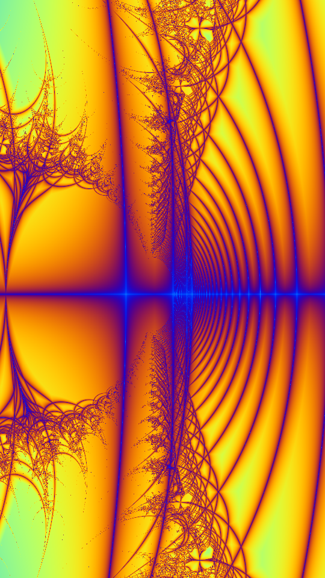

+++
date = '2025-03-08T15:21:55-07:00'
draft = false
title = 'Introducing Sketchy'
tags = ["sketchy", "generative art", "golang"]
categories = ["Development"]
+++

**TL;DR** Sketchy has been around for 3 years, but today marks its first official release, `v0.1.0`. Read below for more
about the generative art framework for Go.

# What is Sketchy?

[Sketchy](https://github.com/aldernero/sketchy) is a framework for generative art, similar to [Processing](https://processing.org/) for Java,
[p5.js](https://p5js.org/) for JavaScript, [vsketch](https://github.com/abey79/vsketch) for Python, and
[openFrameworks](https://openframeworks.cc/) for C++. It provides a canvas and controls for quickly
iterating on designs. It can save results in PNG or SVG format. The latter is what I mostly use as
I typically plot my designs with my AxiDraw v3 pen plotter.

When I needed to learn the Go programming language for a new job, I figured that creating something with Go that
aligned with my favorite hobby (generative art) would make for quick language aquisition. As it was one of the first
apps I wrote in Go, it was a little rough around the edges. Over the last few years I've been both improving Sketchy
and using it to create most of my art. You can see all my art on my [Instagram account](https://www.instagram.com/aldernero/),
below are a few examples from a fractal design.

 

 

 

 Recently I realized that to increase adoption I ought to create a release, and spend more time on adding features
 and functions in a deliberate and planned way. The goal is to eventually get to a `v1.0` release.

# What can Sketchy do?

Sketchy follows the familiar `setup/update/draw` pattern found in many generative art frameworks, shown below:


The configuration file describes things like the sketch dimensions and title, as well as controls like sliders, 
checkboxes, and buttons that can be referenced from code.

In the code itself the controls can be used like

```go
// get the value from a slider control
sliderVal := s.Slider("slider name")  // float64

// both checkboxes and buttons are Toggle structs
toggleVal := s.Toggle("checkbox/button name") // bool
```

Besides the user defined controls, there are some builtin controls that cover the random seed and saving files. The
image below shows an example Control Panel


The github repo has more examples and a tutorial for creating a "Hello Circle" (instead of "Hello World") project.


# What's next?

I plan to add some new features in upcoming releases:

- An `install` sketchy cli subcommand that would create a config file in the user's home directory.
- A configuration file to store things like default colors, fonts, etc. that can be referenced in designs.
- Perhaps a way to design for very large outputs while showing a scaled down version while iterating.
- Maybe additional controls in the Control Panel like color controls.

Like with any open source project, feel free to open issues in the [github repo](https://github.com/aldernero/sketchy/issues) if you want to request features
or run into any bugs.


**Happy Sketching!**