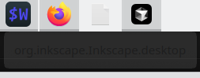
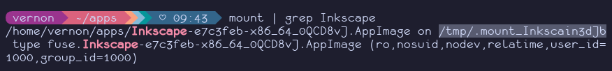
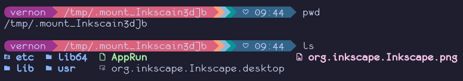
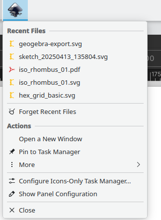

+++
date = '2025-04-20T10:52:03-06:00'
draft = false
title = 'Manual Desktop Entries for AppImage's'
+++

**TL;DR** This short post shows you how to create an application entry for AppImage's in KDE. This makes it easier
to pin the app to the taskbar and makes sure it shows up in KDE's application launcher.

# The Problem

You download an application and it is in the AppImage format. You run it,
then later right-click and pin it to the taskbar. However sometimes there is
no icon, and when you click on it again it won't open because it can't find
the executable. You see a notification that shows it can't find the app in
`/tmp/<some dir>`. 



Other times, depending on how the app is packaged and initially configured,
everything works right out of the box. This post shows you how to make a launcher
for AppImage's manually.

# What to do

As an example I'll work through making a launcher for Inkscape, which prefers
the AppImage format for Linux. Let's assume that I've downloaded the file, `Inkscape-e7c3feb-x86_64_0QCD8vJ.AppImage`,
and put it in my `~/apps/` folder.

Open the app, then see where it is mounted from the terminal



Looking at the directory, there is a logo file (`org.inkscape.Inkscape.png`) and
a desktop file (`org.inkscape.Inkscape.png`). 



Every AppImage I have looked at
has a logo and desktop file, now they just need to go somewhere the system will
recognize them. On Linux systems this will be in the user's `~/.local/` directory.

Move the logo file to `~/.local/share/logos/` and the desktop file to 
`~/.local/share/applications/`.

You may need to edit the `Exec=` using the full path to the AppImage file. In
the case of Inkscape, the default desktop file was overly complex, so I made a
new one with contents

```ini
[Desktop Entry]
Version=1.0
Name=Inkscape
Categories=Graphics
Terminal=false
Icon=org.inkscape.Inkscape
Exec=/home/vernon/apps/Inkscape-e7c3feb-x86_64_0QCD8vJ.AppImage
```

The "Categories" parameter is important as that is where the app will show up
in the system menu (for me it's KDE's application launcher). Run the `update-desktop-database`
command with the local applications directory for the system to recognize the changes.

```bash
update-desktop-database ~/.local/share/applications
```

Now the launcher should be visible from the runner (Alt+F2) and system menus.



And that's it. There are tools for managing AppImage installations, but I use
a small enough number of them that I prefer to manage things manually.