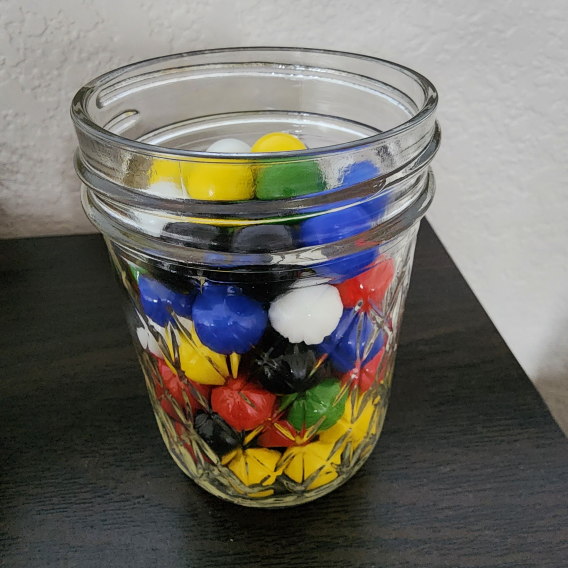
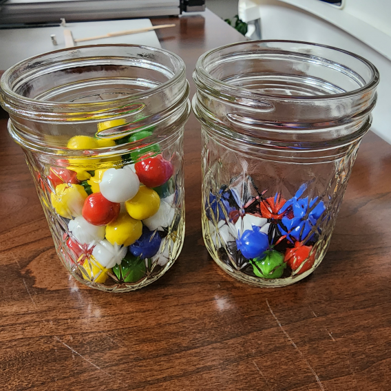

This is an idea I came up with to better keep track of time spent on various activities.

# The Problem

One of my former co-workers used to say

> The days are long and the weeks are short.

This rings true in my experience. It seems like during the day I'm busy enough, but at the end of the week I look back with regret at how little I accomplished. I'm not worried about how much time was spent on urgent tasks and meaningless busy work. I get alarmed however when I consider how much time I'm not spending on the things that are meaningful to me.

This problem is not new for me either. In the past I've thought about using software to keep track of time spent on meaningful but non-urgent activities. I wanted to create something custom to fit my use case, so I started writing a TUI-based program in Go ([Timebox](https://github.com/aldernero/timebox)). The project suffered from predictable scope creep, and required so much time to implement that it was a victim of the problem I'm trying to solve in the first place. I simply didn't spend enough dedicated time on it to reach completion. The code is still a WIP, and I do hope to finish it at some point.

Then over the holiday break a simple idea occurred to me. I have an 8oz Mason jar in my office that I use to hold pens. I thought, what if I get a bunch differently colored marbles, and transfer them from one mason jar to another to track time spent.  The rest of the article describes the Time Jar system I came up with and how it worked out in practice for the first week.

# The Idea

The key concept is that we have a finite amount of time per week. Not only are there just 168 hours, but a lot of that is already "pre-booked". Sleep accounts for 56 hours, and work another 40. That leaves just 72 hours left. 

Let's associate one marble with one hour. Conveniently then, a week's worth of potential time for meaningful activities looks like the picture below, a roughly full jar of marbles. Let's call this jar the "potential jar" Each color represents a different category of activity. The next section has a breakdown of the categories I wanted to focus on. 

A second mason jar is initially empty. Let's call this the "realized jar" Throughout the week, after I spend an hour engaged in one of the tracked categories, I transfer a marble of the associated color from the potential jar to the realized jar. At the end of the week, hopefully the comparison between the two jars should give me some insights and feedback about how to adjust my time management.

# The Categories

These are the categories I'm tracking. These are of course very personalized and are likely to change in the future. The marbles I bought came in six colors, so I picked six areas I'd like to spend more time on:

- **Art** - creating, working on my shop, learning new skills, etc
- **Exercise** - anything that gets me moving, I've been exceedingly sedentary since becoming a remote worker.
- **Writing** - anything really, stories, poems, or blog posts like this.
- **Mindfulness** - meditation, therapy, anything else that promotes better mental health
- **Coding** - coding projects that are not directly related to my generative art
- **Music** - I want to learn guitar and relearn the piano

As an example of how terrible I am at spending time on these, let's look at the last two. The time tracking app I mentioned earlier, Timebox, was initially created in August of 2022 and hasn't had an update since March of 2024. There are plenty of other full-stack side projects in various states of incompleteness. On the music front, I've had a guitar for over a decade that I don't how to play, and a digital piano I haven't touched since I bought it a year or two ago.

# Reflections

Even before starting the week, I realized something important. There should be no expectation that 100% of the marbles are transferred by the end of the week. There are so many things we have do that eat into the potential hours. Running errands, cooking, cleaning, hygiene, and simply transitioning from one activity on another take time that can really add up. In addition, there are lots of things I like to do but aren't in any of the six categories because they are not things that help me develop or grow. For example I love video games and TV, and making time for them is good, but there should be limits. In fact, spending a certain amount of time enjoying those things would make for a good reward system to keep myself motivated to continue this practice. For example for each hour earned in the Time Jar, I could bank 30 minutes of time to spend watching TV. 

Anyway, getting to the results for the week, here is how the two jars looked

The table below shows the breakdown by category.

| Category     | Hours |
| ------------ | ----- |
| art          | 4     |
| exercise     | 6     |
| mindfullness | 2     |
| coding       | 5     |
| music        | 1     |
| **Total**    | 18    |

In all, I spent 18 hours on meaningful activities. Since the potential maximum is 72 hours, this represents a 25% efficiency. It's a low number, but at least it gives me a baseline to measure improvements against. What is the upper limit of efficiency? I have no clue, but I imagine doing better than 75% would be nearly impossible. We will see.

An additional insight arose towards the end of the week. As I was spending more time in some categories compared to others, the marbles on top tended to be for the less consumed categories. I needed to dig deeper to find the right color marble to transfer. It was almost like the jar was telling me to diversify my time more.

# What's Next

I'm pleased with the way the first week went. Although I had a low efficiency (25%) I was surprised by how motivated I was to engage with these meaningful activities so I could transfer a marble and watch them fill up the realized jar. I will continue this practice, with the goal of improving my efficiency in this new week. I also plan to try something similar to track things at work, with 40-50 marbles in 2 separate jars. I'll periodically post updates on my progress and how the practice has (hopefully) improved how I spend my time.